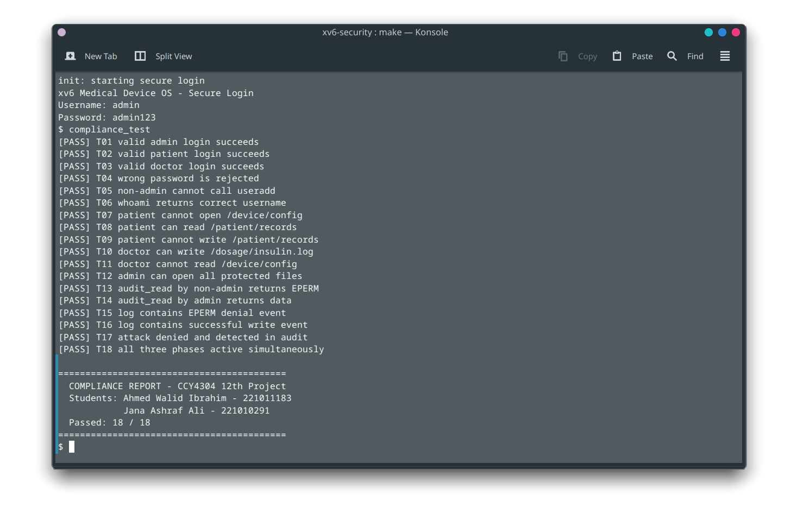

<div id="top"></div>

<div align="center">
  <h2>Operating Systems Security</h2>
  <h3>Ahmed Walid &nbsp;&nbsp;·&nbsp;&nbsp; Jana Ashraf</h3>
  <p>
    CCY4304 12th Project: xv6 Medical Device Security
    <br />
    <a href="https://ossec.ahmeddwalid.me"><strong>Explore the docs »</strong></a>
    <br /><br />
    <a href="https://github.com/ahmeddwalid/OSSec12th/issues">Report Bug</a>
    &nbsp;·&nbsp;
    <a href="https://github.com/ahmeddwalid/OSSec12th/pulls">Request Feature</a>
  </p>
</div>

<!-- TABLE OF CONTENTS -->
<details>
  <summary>Table of Contents</summary>
  <ol>
    <li><a href="#about-the-project">About the Project</a></li>
    <li><a href="#team">Team</a></li>
    <li>
      <a href="#quick-start">Quick Start</a>
      <ul>
        <li><a href="#fedora--rhel">Fedora / RHEL</a></li>
        <li><a href="#debianubuntukali-linux">Debian / Ubuntu / Kali Linux</a></li>
        <li><a href="#arch-linux">Arch Linux</a></li>
      </ul>
    </li>
    <li><a href="#repository-layout">Repository Layout</a></li>
    <li><a href="#security-phases">Security Phases</a></li>
    <li><a href="#compliance-results">Compliance Results</a></li>
    <li><a href="#documentation-site">Documentation Site</a></li>
    <li><a href="#toolchain-versions">Toolchain Versions</a></li>
  </ol>
</details>

---

## About the Project

This repository extends **xv6-riscv** with three security phases to demonstrate OS-level security controls relevant to connected medical devices. The scenario is inspired by the 2019 Medtronic MiniMed 508 insulin pump recall (CVE-2019-10964), where lack of authentication on a wireless interface allowed remote manipulation of insulin doses.

The implementation satisfies the CIA triad requirements for a medical-device OS and maps to FDA 2023 cybersecurity guidance and IEC 62443 security requirements.

<p align="right">(<a href="#top">back to top</a>)</p>

---

## Team

| Name | Student ID | Role |
|------|-----------|------|
| Ahmed Walid Ibrahim | 221011183 | Developer |
| Jana Ashraf Ali | 221010291 | Developer |

**Lecturer:** Prof. Dr. Ayman Adel Abdel-Hamid  
**Teaching Assistant:** Abdelrahman Solyman  
**Course:** CCY4304: Operating Systems Security  
**University:** Arab Academy for Science, Technology and Maritime Transport

<p align="right">(<a href="#top">back to top</a>)</p>

---

## Quick Start

### Fedora / RHEL

```bash
sudo dnf install make gcc perl python3 bc qemu-system-riscv-core \
                 gcc-riscv64-linux-gnu binutils-riscv64-linux-gnu \
                 nodejs npm
```

### Debian / Ubuntu / Kali Linux

```bash
sudo apt update
sudo apt install make gcc perl python3 bc qemu-system-misc \
                 gcc-riscv64-linux-gnu binutils-riscv64-linux-gnu \
                 nodejs npm
```

> **Ubuntu 22.04+ / Kali note:** the package `qemu-system-misc` provides `qemu-system-riscv64`. On older Ubuntu (20.04) you may need to install QEMU from the QEMU PPA:
> ```bash
> sudo add-apt-repository ppa:canonical-server/server-backports
> sudo apt update && sudo apt install qemu-system-riscv
> ```

### Arch Linux

```bash
sudo pacman -S make gcc perl python3 bc qemu-system-riscv \
               riscv64-linux-gnu-gcc riscv64-linux-gnu-binutils \
               nodejs npm
```

> **AUR alternative:** if `riscv64-linux-gnu-gcc` is not in the official repos for your version, install via AUR:
> ```bash
> yay -S riscv64-linux-gnu-gcc riscv64-linux-gnu-binutils
> ```

### Build and Run

After installing the toolchain on any distro:

```bash
# Build the kernel
cd xv6-security
make clean && make

# Boot in QEMU (terminal only)
make qemu-nox

# Press Ctrl-A then X to exit QEMU
```

### Log In

At the secure login prompt:

| Username | Password | Role |
|----------|----------|------|
| `root` | `root123` | Administrator |
| `admin` | `admin123` | Administrator |
| `doctor1` | `doctor123` | Clinician |
| `patient1` | `patient123` | Patient |

### Run Compliance Tests

```sh
compliance_test
audit_dump
```

<p align="right">(<a href="#top">back to top</a>)</p>

---

## Repository Layout

```
.
├── xv6-security/        Modified xv6-riscv kernel + user programs
│   ├── kernel/          auth.c, perms.c, audit.c, fs.c (modified)
│   ├── user/            login.c, audit_dump.c, compliance_test.c
│   └── mkfs/            mkfs.c (creates medical demo files)
├── docs/                Docusaurus documentation site
│   ├── docs/            Markdown pages for all 7 sections
│   └── src/pages/       Landing page (index.tsx)
└── README.md            This file
```

<p align="right">(<a href="#top">back to top</a>)</p>

---

## Security Phases

| Phase | Feature | Kernel files |
|-------|---------|-------------|
| 1: Authentication | Login + identity in `struct proc` (uid/gid/role/authenticated) | `kernel/auth.c`, `kernel/sysproc.c` |
| 2: File Permissions | Unix-style mode bits + owner on every inode; DAC at 4 hook points | `kernel/fs.c`, `kernel/perms.c`, `kernel/sysfile.c` |
| 3: Audit Log | 256-entry kernel ring buffer, spinlock-protected, admin-only read | `kernel/audit.c`, `kernel/trap.c` |

<p align="right">(<a href="#top">back to top</a>)</p>

---

## Compliance Results

[](docs/static/img/screenshots/compliance-full-pass.png)

<p align="right">(<a href="#top">back to top</a>)</p>

---

## Documentation Site

The full documentation is hosted at **[ossec.ahmeddwalid.me](https://ossec.ahmeddwalid.me)**.

To build locally:

```bash
cd docs
npm install
npm run build
npm run serve    # preview at http://localhost:3000
```

<p align="right">(<a href="#top">back to top</a>)</p>

---

## Toolchain Versions

| Tool | Version used |
|------|-------------|
| `riscv64-linux-gnu-gcc` | 15.2.1 |
| `qemu-system-riscv64` | 10.2.2 |
| `make` | 4.4.1 |
| Node.js | 22.x |

<p align="right">(<a href="#top">back to top</a>)</p>
