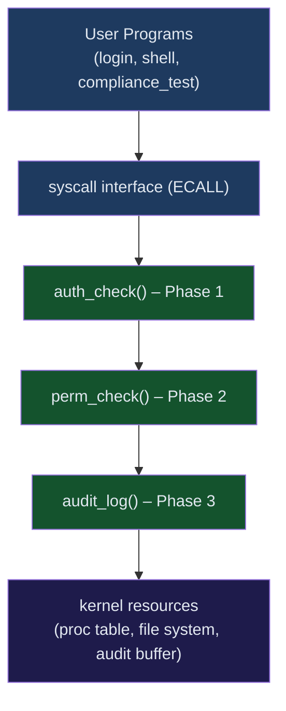

# Project Overview

## The Medical-Device Security Problem

In 2019, Medtronic disclosed that its **MiniMed 508 insulin pump** could be wirelessly commanded by an attacker to deliver a lethal overdose — with no authentication whatsoever. The FDA issued a Class I recall (the most severe level). Root cause: the device OS had no concept of user identity, no file-level access controls, and no audit trail. Any process could do anything.

This project answers the question: *what is the minimum OS-level security infrastructure a medical device must have?*

We retrofit **xv6-riscv** — MIT's teaching kernel used in OS courses worldwide — with three security layers that map directly to the controls the FDA's 2023 cybersecurity guidance and IEC 62443 require.

## What xv6 Is

xv6 is an intentionally minimal re-implementation of UNIX v6 in ~10 000 lines of C and RISC-V assembly. It was designed by Robert Morris, Frans Kaashoek, and Russ Cox at MIT to be the simplest possible real kernel — bootable, multi-process, with a file system and a shell. Every line is readable in a day.

That minimalism is exactly what makes it the right substrate for this project. Every security hook we add is immediately visible in context. There is no driver jungle, no MM complexity, no hidden abstraction. The kernel is transparent.

## Three Security Phases

| Phase | What it adds | Why it matters |
|-------|-------------|----------------|
| **1 – Authentication** | Per-process UID/GID/role; boot-time `login` program; `/etc/passwd` credential store | Establishes identity — the foundation of all other controls |
| **2 – File Permissions** | Unix `rwxrwxrwx` mode bits + owner on every inode; DAC enforcement at 4 kernel hook points | Ensures only the right role (clinician/admin) can touch patient files |
| **3 – Audit Log** | 256-entry kernel ring buffer; every syscall decision logged with timestamp, UID, result | Provides the non-repudiation trail the FDA requires |

The **bonus `compliance_test`** program runs 18 automated tests and produces a structured pass/fail report that maps each test to a regulatory requirement.

## Architecture



## Repository Structure

```
OSSec12th/
├── xv6-security/          ← modified kernel
│   ├── kernel/
│   │   ├── proc.h         ← uid, gid, role, authenticated added
│   │   ├── proc.c         ← scheduler and fork changes
│   │   ├── fs.h           ← dinode mode/uid/gid fields
│   │   ├── sysfile.c      ← perm_check() hooks
│   │   ├── audit.c        ← ring buffer + audit_log()
│   │   ├── audit.h
│   │   └── trap.c         ← audit printing on exit
│   ├── user/
│   │   ├── login.c        ← boot-time authenticator
│   │   └── compliance_test.c
│   ├── etc/passwd         ← credential store
│   └── Makefile
├── docs/                  ← this Docusaurus site
├── .github/workflows/     ← CI/CD deploy pipeline
└── README.md
```

## Quick Start

```bash
# 1 – Install toolchain (Fedora)
sudo dnf install gcc-riscv64-linux-gnu qemu-system-riscv

# 2 – Build and boot
cd xv6-security
make qemu

# 3 – Log in as admin
login: root
password: root123

# 4 – Run compliance tests
$ compliance_test

# 5 – Quit QEMU
Ctrl-A  X
```

## Team

| Name | Student ID |
|------|-----------|
| Ahmed Walid Ibrahim | 221011183 |
| Ahmed Mohamed Mahmoud | 221010720 |

**Course:** CCY4304 – Operating Systems Security  
**Lecturer:** Prof. Dr. Ayman Adel Abdel-Hamid  
**TA:** Abdelrahman Solyman

The goal is not to replace Linux security. The goal is to make each control visible enough for students to trace from syscall to kernel decision to user-visible behavior.

## Implementation Walk-through

Start with the boot path. `init` now launches `login`, and successful login executes `sh`. The kernel seeds `/etc/passwd` during filesystem initialization so the first boot has known demo accounts.

Then follow file access. `open`, `read`, `write`, and `exec` consult permission metadata through the permission helper. Admin users bypass permission checks, while patient and doctor identities are limited by owner, group, and other bits.

Finally, follow syscall return paths. Each syscall result is recorded in the audit ring. The admin-only `audit_read` syscall exposes the ring to `audit_dump` and `compliance_test`.

## How to Test

Build and boot xv6:

```bash
cd xv6-security
make clean
make
make qemu-nox
```

Log in as `admin` with password `admin123`, then run:

```sh
compliance_test
audit_dump
```

The compliance report should end with:

```text
Passed: 18 / 18
```

## Common Pitfalls

One easy mistake is treating xv6 like a normal Unix host. It has a tiny libc, a tiny shell, and no dynamic linker. Tests and tools must stay within the user library that xv6 provides.

Another pitfall is forgetting that audit printing is intentionally noisy. The trap audit line prints for every syscall trap, and xv6 writes console output one byte at a time. For verification, strip audit lines from captured QEMU output before reading test summaries.
