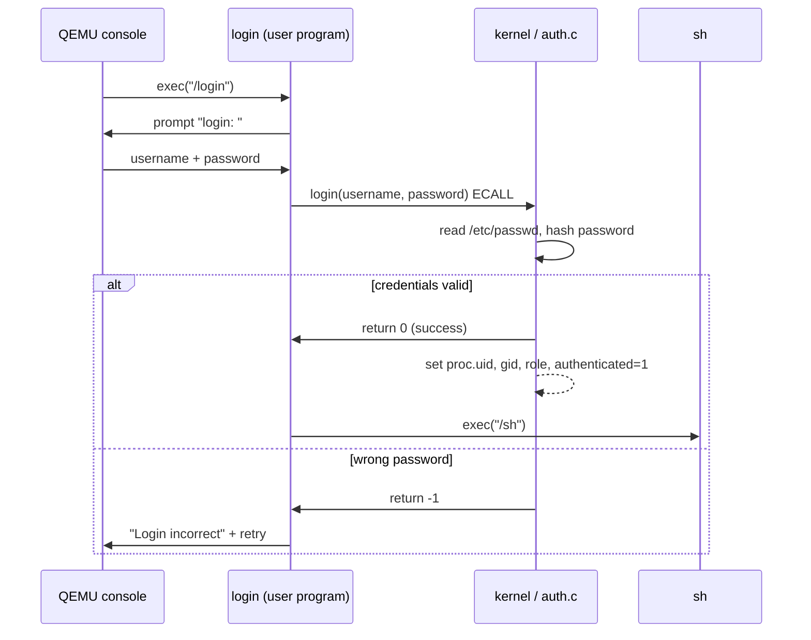

# Phase 1: Authentication

## Motivation

Stock xv6 calls `exec("sh", ...)` in `init.c` and the shell runs immediately with no identity. Any process is implicitly trusted equally. For a medical device this is catastrophic: a patient application could call any syscall, read any file, modify any device configuration.

Phase 1 imposes an identity boundary at the earliest possible moment, before the first shell command executes.

## Original xv6 vs Phase 1 Code Delta

Stock xv6 has no login step and no kernel-backed user identity. This phase introduces both.

| Component | Stock xv6-riscv | Modified xv6-security |
|-----------|------------------|------------------------|
| Boot program | `user/init.c` starts `sh` directly | `user/init.c` starts `login` first |
| Process credentials | `struct proc` has no user fields | Added `uid`, `gid`, `role`, `username`, `authenticated` |
| Auth backend | No credential database | `/etc/passwd` seeded at boot via `auth_init()` |
| Auth syscalls | None | `sys_login`, `sys_whoami`, `sys_useradd`, `sys_userdel`, `sys_passwd` |
| Fork behavior | Child inherits memory/files only | Child also inherits identity fields (`uid/gid/role/username/authenticated`) |

Files touched for this phase: `kernel/proc.h`, `kernel/proc.c`, `kernel/auth.h`, `kernel/auth.c`, `kernel/sysfile.c`, `kernel/syscall.c`, `kernel/syscall.h`, `user/init.c`, `user/login.c`.

## What Changed in `struct proc`

Before Phase 1, `struct proc` had no user-identity fields at all. After Phase 1:

```c
/* kernel/proc.h: new fields */
struct proc {
  // ... existing fields ...
  int uid;                   // numeric user ID
  int gid;                   // numeric group ID
  int role;                  // ROLE_ADMIN / ROLE_DOCTOR / ROLE_PATIENT
  char username[16];         // for audit and whoami
  int authenticated;         // 0 until login() syscall succeeds
};
```

Forked children inherit all five fields, so every descendant of a logged-in shell carries the same identity.

Compared to stock xv6, this is the foundational kernel ABI change for user identity. Later phases (permissions and audit) rely on these fields rather than on user-space trust.

## The `/etc/passwd` Format

```
username|uid|gid|role|hash
```

| Field | Example | Notes |
|-------|---------|-------|
| `username` | `admin` | Max 15 chars |
| `uid` | `0` | 0 = admin |
| `gid` | `0` | group ID |
| `role` | `0` | 0=admin, 1=doctor, 2=patient |
| `hash` | `a3f8...` | Four-word djb2-style hash (teaching model) |

Stock xv6 does not ship `/etc/passwd` or account management syscalls. Here, `auth_init()` creates `/etc` and `/etc/passwd` on first boot and seeds three demo users so the secure boot path is immediately testable.

Demo accounts baked into the image:

| Username | Password | Role |
|----------|----------|------|
| `admin` | `admin123` | Administrator |
| `doctor1` | `doctor123` | Doctor |
| `patient1` | `patient123` | Patient |

## Login Sequence



## Syscall Surface


| Syscall | Who can call | Description |
|---------|-------------|-------------|
| `login(user, pass)` | Anyone | Authenticate; sets kernel identity |
| `whoami(buf, len)` | Anyone | Copy current `username` to user buffer |
| `useradd(user, pass, role)` | Admin only | Create account entry in `/etc/passwd` |
| `userdel(user)` | Admin only | Remove account entry |
| `passwd(user, newpass)` | Admin only | Change password |

Compared with original xv6, these syscall numbers are newly assigned in the syscall table and dispatched through `kernel/syscall.c`.

The admin-only restriction is enforced **inside the kernel** (`kernel/auth.c`), not just in the user tool. A patient cannot call `useradd` by constructing a raw ECALL.

## `login.c` Walk-through

```c
// user/login.c (simplified)
int main(void) {
  char user[16], pass[32];
  for (;;) {
    printf("login: ");   read_line(user, sizeof user);
    printf("password: "); read_line(pass, sizeof pass);

    int r = login(user, pass);   // ECALL → sys_login()
    if (r == 0) {
      char *argv[] = { "sh", 0 };
      exec("/sh", argv);
      // exec only returns on failure
    }
    printf("Login incorrect\n\n");
  }
}
```

`exec` overwrites the login process image with the shell. The kernel's `proc` entry keeps `uid`, `gid`, `role`, and `authenticated = 1` across the `exec` because credentials are stored in `struct proc`, not in the user-space image.

In stock xv6, the equivalent control flow is `init -> sh` with no identity gate. The modified flow is `init -> login -> sh` and only transitions to shell after `sys_login` succeeds.

## Compliance Coverage

| Test | What it checks |
|------|---------------|
| T01 | Valid admin login succeeds |
| T02 | Valid patient login succeeds |
| T03 | Wrong password is rejected |
| T04 | `whoami` returns the correct username |
| T05 | `useradd` by non-admin returns `-EPERM` |
| T06 | `userdel` by non-admin returns `-EPERM` |

## Security Notes

- The hash in this teaching implementation is a simple XOR+sum over the password bytes. **This is not production-quality.** A real system would use Argon2id or bcrypt with a per-account salt.
- Forked children inherit `uid`, `gid`, `role`, `username`, and `authenticated` from the parent in `kfork()`. This is intentional for a Unix-style session model where child processes run under the same logged-in identity.


Remember to copy credentials on fork. If the child shell loses identity, later permission checks and audit entries become misleading.

Avoid storing plaintext passwords in the filesystem. Even in xv6, the project should model safer habits.
