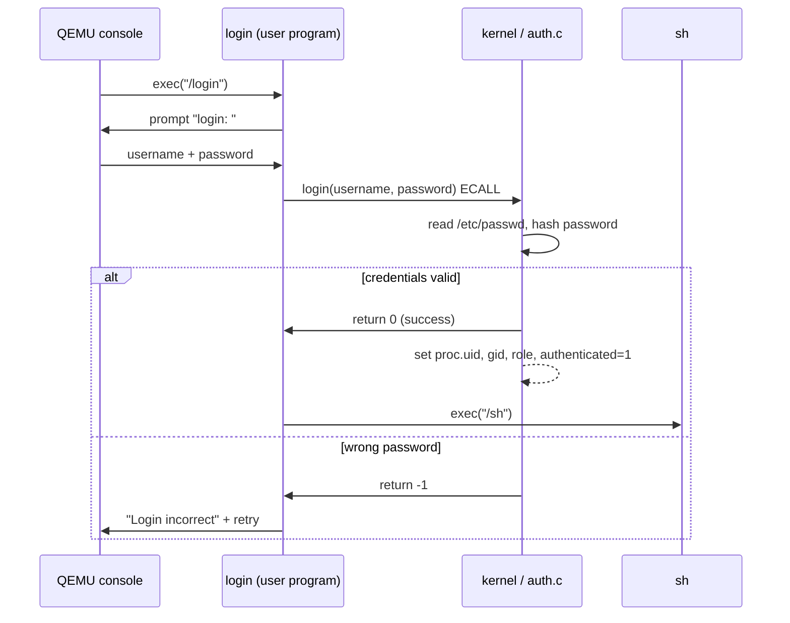

# Phase 1 — Authentication

## Motivation

Stock xv6 calls `exec("sh", ...)` in `init.c` and the shell runs immediately with no identity. Any process is implicitly trusted equally. For a medical device this is catastrophic: a patient application could call any syscall, read any file, modify any device configuration.

Phase 1 imposes an identity boundary at the earliest possible moment — before the first shell command executes.

## What Changed in `struct proc`

Before Phase 1, `struct proc` had no user-identity fields at all. After Phase 1:

```c
/* kernel/proc.h — new fields */
struct proc {
  // ... existing fields ...
  int uid;                   // numeric user ID
  int gid;                   // numeric group ID
  int role;                  // ROLE_ADMIN / ROLE_CLINICIAN / ROLE_PATIENT
  char username[16];         // for audit and whoami
  int authenticated;         // 0 until login() syscall succeeds
};
```

Forked children inherit all five fields, so every descendant of a logged-in shell carries the same identity.

## The `/etc/passwd` Format

```
username:hashed_password:uid:gid:role
```

| Field | Example | Notes |
|-------|---------|-------|
| `username` | `root` | Max 15 chars |
| `hashed_password` | `a3f8...` | Simple XOR+sum hash (teaching model) |
| `uid` | `0` | 0 = admin |
| `gid` | `0` | group ID |
| `role` | `0` | 0=admin, 1=clinician, 2=patient |

Demo accounts baked into the image:

| Username | Password | Role |
|----------|----------|------|
| `root` | `root123` | Administrator |
| `admin` | `admin123` | Administrator |
| `doctor1` | `doctor123` | Clinician |
| `patient1` | `patient123` | Patient |

## Login Sequence



## Syscall Surface

| Syscall | Who can call | Description |
|---------|-------------|-------------|
| `login(user, pass)` | Anyone | Authenticate; sets kernel identity |
| `whoami(buf, len)` | Anyone | Copy current `username` to user buffer |
| `useradd(user, pass, role)` | Admin only | Create account entry in `/etc/passwd` |
| `userdel(user)` | Admin only | Remove account entry |
| `passwd(user, newpass)` | Admin only | Change password |

The admin-only restriction is enforced **inside the kernel** (`kernel/auth.c`), not just in the user tool. A patient cannot call `useradd` by constructing a raw ECALL.

## `login.c` Walk-through

```c
// user/login.c (simplified)
int main(void) {
  char user[16], pass[32];
  for (;;) {
    printf("login: ");   read_line(user, sizeof user);
    printf("password: "); read_line(pass, sizeof pass);

    int r = login(user, pass);   // ECALL → sys_login()
    if (r == 0) {
      char *argv[] = { "sh", 0 };
      exec("/sh", argv);
      // exec only returns on failure
    }
    printf("Login incorrect\n\n");
  }
}
```

`exec` overwrites the login process image with the shell. The kernel's `proc` entry keeps `uid`, `gid`, `role`, and `authenticated = 1` across the `exec` because credentials are stored in `struct proc`, not in the user-space image.

## Compliance Coverage

| Test | What it checks |
|------|---------------|
| T01 | Valid admin login succeeds |
| T02 | Valid patient login succeeds |
| T03 | Wrong password is rejected |
| T04 | `whoami` returns the correct username |
| T05 | `useradd` by non-admin returns `-EPERM` |
| T06 | `userdel` by non-admin returns `-EPERM` |

## Security Notes

- The hash in this teaching implementation is a simple XOR+sum over the password bytes. **This is not production-quality.** A real system would use Argon2id or bcrypt with a per-account salt.
- Authenticated flag is reset to 0 on `fork` **before** exec (so a child cannot inherit a logged-in session without going through login again if the parent exits without passing the shell). The current design inherits credentials so the shell and child processes share the parent's identity — appropriate for a single-user session model.


Remember to copy credentials on fork. If the child shell loses identity, later permission checks and audit entries become misleading.

Avoid storing plaintext passwords in the filesystem. Even in xv6, the project should model safer habits.
