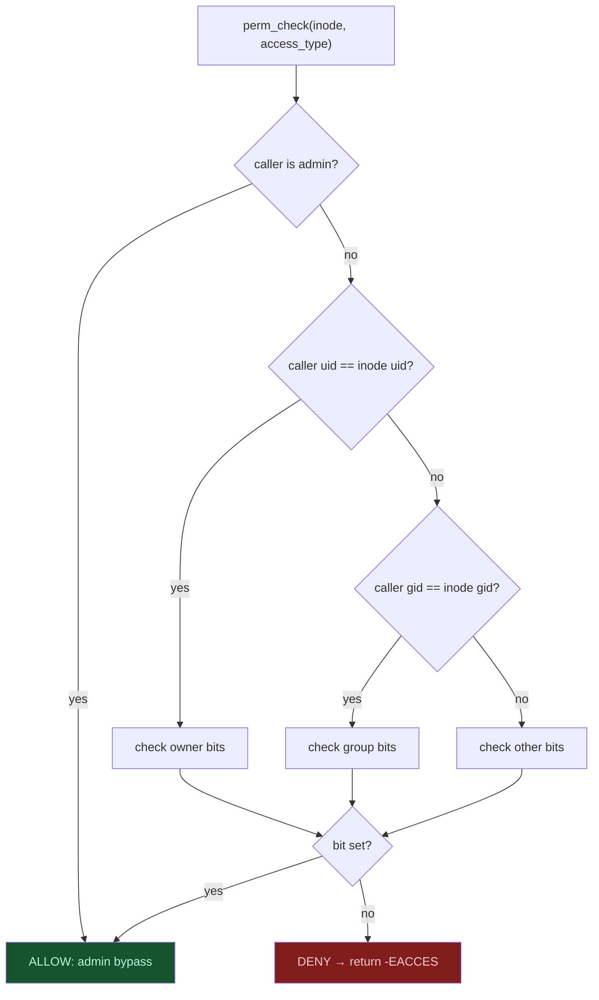

# Phase 2: File Permissions

## Motivation

After Phase 1 establishes *who* the user is, Phase 2 answers *what* they are allowed to touch. Without file permissions, a logged-in patient can open `/device/config`, overwrite `/dosage/insulin.log`, or read the audit log: defeating the entire point of authentication.

Phase 2 adds Unix-style DAC (Discretionary Access Control) to every inode.

## The Permission Bit Model

Unix permission bits pack into a 16-bit `mode` word:

```
  15–12     11–9      8–6       5–3       2–0
  filetype  (unused)  owner     group     other
              rwx       rwx       rwx
```

Each three-bit group:

| Bit position | Meaning |
|-------------|---------|
| `r` (bit 2) | Read access |
| `w` (bit 1) | Write access |
| `x` (bit 0) | Execute access |

Example: `0644` = `rw-r--r--`:
- Owner: read + write
- Group: read only
- Other: read only

## What Changed in `struct dinode`

```c
/* kernel/fs.h: new fields on the on-disk inode */
struct dinode {
  short type;    // existing: T_FILE, T_DIR, T_DEVICE
  short mode;    // NEW: octal permission bits
  short uid;     // NEW: owner user ID
  short gid;     // NEW: owner group ID
  // ... rest unchanged ...
};
```

The in-memory `struct inode` mirrors these fields. `ialloc`, `iupdate`, `ilock`, and `stati` all read and write the new fields.

## Medical Files and Their Permissions

`mkfs/mkfs.c` creates these files at image build time:

| Path | Mode | Owner | Accessible by |
|------|------|-------|--------------|
| `/patient/records` | `0640` | uid=2 (patient) | Patient (rw), clinician-group (r), admin override |
| `/dosage/insulin.log` | `0660` | uid=1 (doctor) | Clinician (rw), admin override |
| `/device/config` | `0600` | uid=0 (admin) | Admin only |
| `/audit/syscall.log` | `0400` | uid=0 (admin) | Admin read-only |

## `perm_check()` Flowchart



## The Four Enforcement Points

Every file access in xv6 passes through one of these four kernel locations:

| Hook | File | When it runs |
|------|------|-------------|
| `sys_open()` | `kernel/sysfile.c` | Before any file descriptor is created |
| `fileread()` | `kernel/file.c` | On every `read()` syscall |
| `filewrite()` | `kernel/file.c` | On every `write()` syscall |
| `sys_exec()` | `kernel/exec.c` | Before loading a program image |

Checking only at `open` is insufficient: an attacker with an already-open fd could still read/write after their permission is revoked.

## `chmod` and `chown` Syscalls

```bash
# Inside xv6 shell (admin logged in)

# Restrict config to admin-only
chmod /device/config 0600

# Transfer ownership of a log file
chown /dosage/insulin.log 1 1
```

Both syscalls require the caller to be admin or the owner of the target file. A patient cannot `chown` their own records to another user.

## Compliance Coverage


| Test | What it checks |
|------|---------------|
| T07 | Patient cannot open `/device/config` (EACCES) |
| T08 | Patient can read `/patient/records` |
| T09 | Patient cannot write `/patient/records` (EACCES) |
| T10 | Clinician can write `/dosage/insulin.log` |
| T11 | Clinician cannot read `/device/config` (EACCES) |
| T12 | Admin can open all protected files |

## Known Implementation Detail: `DIRSIZ`

The filename `compliance_test` is 16 characters. The original xv6 `DIRSIZ` is 14. We increased it to 16:

```c
/* kernel/fs.h */
#define DIRSIZ 16
```

This required updating `mkfs.c` to pad directory entries to the new size so that `ls` and directory reads remain aligned to `struct dirent`.

